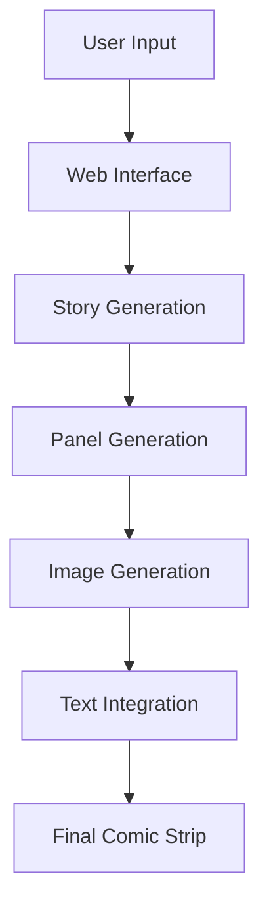

# ComicCrafter AI 🎨

## 📺 Demo
https://drive.google.com/file/d/1d81shRDNjODGUSOXxpbf3PQ7IaqqUbl-/view?usp=sharing

## 📖 Overview

ComicCrafter AI is an innovative AI-powered comic generation system that transforms textual narratives into visually engaging comic strips. Using state-of-the-art AI models, it automates the entire comic creation pipeline - from story interpretation to final comic strip rendering, making comic creation accessible to everyone.

## Team Members
- Anvesha
- Balajee


## ✨ Key Features

- 🎨 **Multi-Style Generation**
  - 🎌 Manga: High-contrast B&W sketch style
  - 🌸 Anime: Vibrant colors with cel shading
  - 🦸‍♂️ American: Bold outlines with heavy inking
  - 🇧🇪 Belgian: Clean lines with Tintin-style aesthetics

- 📝 **Story-Driven Generation**
- 🖼️ **Automated Panel Creation**
- 💬 **Dynamic Text Integration**
- 🎯 **High-Quality Output**
- 🌟 **User-Friendly Interface**

## 🚀 Potential Use Cases

### 📚 Education
- Interactive storytelling for learning
- Historical event visualization
- Scientific concept explanation

### 🎮 Entertainment
- Personal comic creation
- Social media content
- Fan fiction visualization

### 💼 Professional Use
- Storyboard creation
- Marketing materials
- Product demonstrations

### 🎨 Creative Projects
- Independent comic creation
- Visual storytelling
- Content prototyping

## 🔧 Implementation Guide

### Prerequisites
```bash
- Python 3.8+
- Git
- Internet connection for API access
```

### Installation

1. **Clone the Repository**
```bash
git clone https://github.com/yourusername/ComicCrafter-AI.git
cd ComicCrafter-AI
```

2. **Install Dependencies**
```bash
pip install -r requirements.txt
```

3. **Configure API Keys**
```bash
# Create .env file and add your keys
GOOGLE_API_KEY=your_google_api_key
CLIPDROP_API_KEY=your_clipdrop_api_key
```

4. **Run the Application**
```bash
streamlit run app.py
```

## ⚙️ Processing Pipeline

1. **Story Input & Analysis**
2. **Panel Generation**
3. **Image Creation**
4. **Text Integration**
5. **Final Assembly**

## 🧠 System Architecture



## 🧰 Tech Stack

| Component | Technology |
|-----------|------------|
| Frontend | Streamlit |
| Backend | Python 3.x |
| AI Services | Google Generative AI (Gemini Pro) |
| Image Generation | ClipDrop API (Stability AI) |
| Image Processing | Pillow |
| Document Generation | ReportLab |

## 🛠️ Project Structure

```
ComicCrafter-AI/
├── app.py                  # Main application
├── BACKEND/               
│   ├── generate_panels.py  # Panel generation
│   ├── generate_image.py   # Image generation
│   ├── main.py            # Core logic
│   └── process_comic.py    # Comic assembly
├── PANEL_IMAGES/           # Temporary storage
├── output/                 # Final output
├── .env                    # Configuration
└── requirements.txt        # Dependencies
```

## 🚀 Future Enhancements

### 🔄 Technical Improvements
- [ ] Integration with more AI models
- [ ] Enhanced style customization
- [ ] Improved text placement algorithms

### ✨ Feature Additions
- [ ] Multi-page comic support
- [ ] Animation integration
- [ ] Custom panel layouts
- [ ] Voice-to-comic generation

### 📱 User Experience
- [ ] Mobile app development
- [ ] Cloud storage integration
- [ ] Collaborative editing features

### 🎨 Style Expansion
- [ ] Additional art styles
- [ ] Custom style training
- [ ] Style mixing capabilities


---
<div align="center">
Made by Anvesha & Balajee 


</div>


